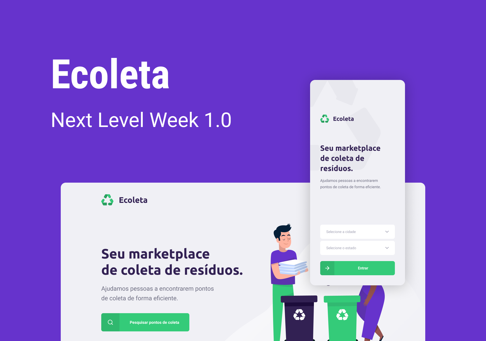

<h1 align="center">
    
    <br>Next Level Week #1<br/>
    Node.js | ReactJS | React Native
</h1>

<p align="center">
  
  
  
   
  
</p>

<p align="center">
  
<p>

## :bookmark: Projeto

O <strong>Ecoleta</strong> é uma aplicação Web e Mobile para ajudar pessoas a encontrarem pontos de coleta para reciclagem.

Essa aplicação foi durante a <strong>Next Level Week #1</strong> realizada pela [Rocketseat](https://rocketseat.com.br/). Por fim, a inspiração do projeto surgiu com a coincidência do evento estar sendo realizado durante a <strong>semana do meio ambiente</strong>.

## :rocket: Tecnologias

-  [Typescript](https://www.typescriptlang.org/)
-  [Node.js](https://nodejs.org/en/)
-  [Express](https://expressjs.com/)
-  [axios](https://github.com/axios/axios)
-  [ReactJS](https://reactjs.org/)
-  [React Native](http://facebook.github.io/react-native/)
-  [React Navigation](https://reactnavigation.org/)
-  [Expo](https://expo.io/)

## :boom: Como Executar

- ### **Pré-requisitos**

  - É **necessário** possuir o **[Node.js](https://nodejs.org/en/)** instalado no computador
  - É **necessário** possuir o **[Git](https://git-scm.com/)** instalado e configurado no computador
  - Também, é **preciso** ter um gerenciador de pacotes seja o **[NPM](https://www.npmjs.com/)** ou **[Yarn](https://yarnpkg.com/)**.
  - Por fim, é **essencial** ter o **[Expo](https://expo.io/)** instalado de forma global na máquina

1. Faça um clone do repositório:

```sh
  $ git clone https://github.com/HigorSnt/ecoleta.git
```

2. Executando a Aplicação:

```sh
  # API
  $ cd server
  # Instalando as dependências do projeto.
  $ npm install
  # Configurando o banco de dados, criando as tabelas e os itens que já são pré-cadastrados.
  $ npm run knex:migrate
  $ npm run knex:seed

  # Inicie a API
  $ npm run dev

  # Aplicação web
  $ cd web
  # Instalando as dependências do projeto.
  $ npm install
  # Inicie a aplicação web
  $ npm start

  # Aplicação mobile
  $ cd mobile
  # Instalando as dependências do projeto.
  $ npm install
  # Inicie a aplicação mobile
  $ npm start
```

## :memo: Licença

Esse projeto está sob a licença MIT. Veja o arquivo [LICENSE](LICENSE.md) para mais detalhes.

---
<sup>Projeto desenvolvido com a tutoria de [Diego Fernandes](https://github.com/diego3g), da [Rocketseat](rocketseat.com.br).</sup>